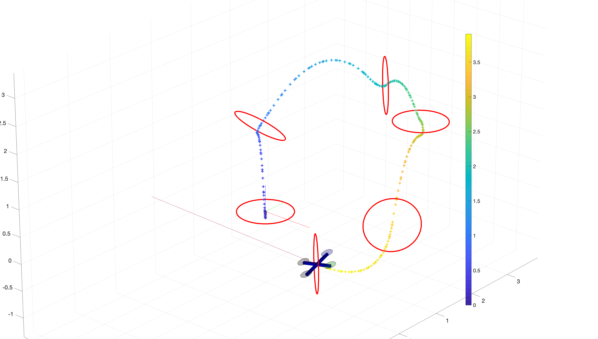
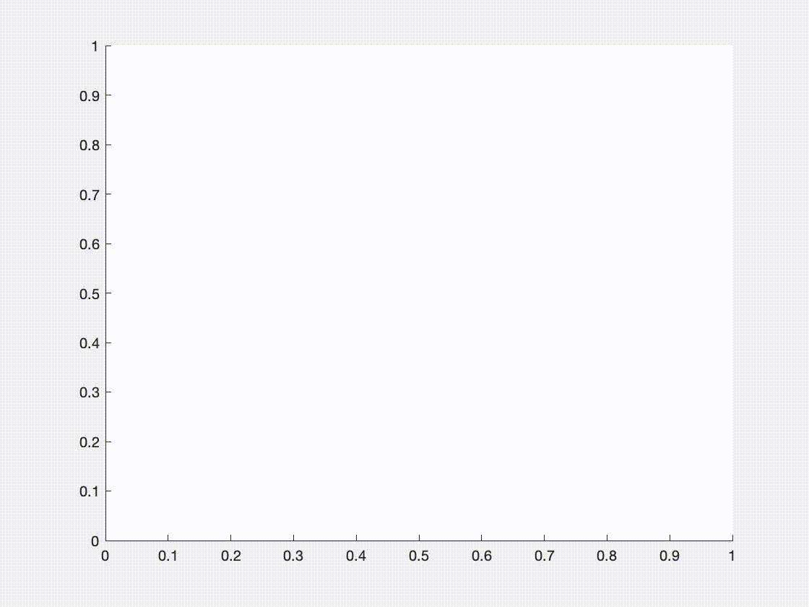

# Project for MIT 16.32 Principles of Optimal Control and Estimation

Optimal control and trajectory estimation of a nonlinear model of a Quadcopter.

## Minimum Time Optimal Control Problem

In light of the recent interest in drone racing, both manned and unmanned, we present an approach to calculate the **optimal control inputs and state trajectory of a quadcopter to finish a given race track in a minimum time**.
We assume the race track to consist of a set of arbitrarily positioned gates in 3D that the drone has to go through.
    We show how to solve this problem by using **GPOPS-II**, a matlab-based general purpose optimal control software.
    The hope of this work is to provide useful information for human pilots, and developers of autonomous drones, as could be provided by a tactician in an air race competition.
    
    
## Results

## Future Work

A common behaviour in human drone races is to orient the onboard camera of the drone in the direction of travel so that the human pilot can see where the drone is heading.
Nevertheless, in our work, we did not set explicit path constraints that would enforce the orientation of the drone to be aligned with the velocity vector.
Therefore, as seen in the video below, the orientation of the camera is not accounted in the optimization:

https://youtu.be/zyDAMC3OjAY

